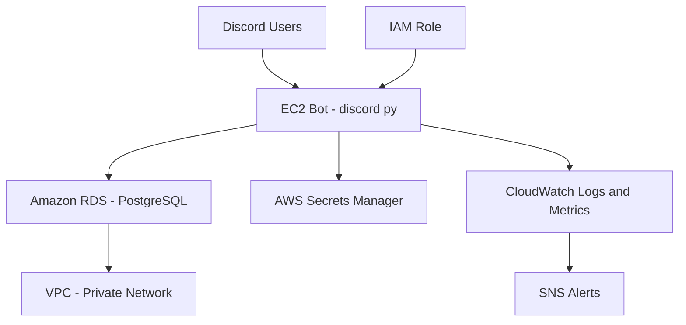

# 🟩 Wordle Discord Leaderboard Bot

Wordle Discord Leaderboard Bot is a fully automated Discord bot built in Python that tracks and ranks Wordle performance among users in a server. It listens for scores posted manually (e.g., `Wordle 1418 4/6`), through the `/share` command from the official Wordle app, and from daily summary messages (e.g., `👑 3/6: @User1 @User2`). All scores are stored in a PostgreSQL database, hosted on AWS RDS and accessed securely using AWS Secrets Manager.

The leaderboard is updated in real time and available via the `/leaderboard` slash command. Admins can reset all scores using `/resetleaderboard`.  


---

## 📌 Features

✅ Parse Wordle scores like `Wordle 1418 3/6` or `/share`  

✅ Extract player data from official daily summary messages  

✅ Auto-detect Wordle number based on the current date  

✅ Slash commands: `/leaderboard`, `/resetleaderboard`  

✅ Duplicate submission protection (DB constraints)  

✅ Robust infrastructure monitoring (CloudWatch + SNS)  

✅ Secure credentials (AWS Secrets Manager)  

✅ Fully hosted on AWS using EC2 + RDS + systemd  

---

## ☁️ Hosted & Powered by AWS

| Component        | AWS Service             | Purpose                                                   |
|------------------|--------------------------|------------------------------------------------------------|
| 💻 Hosting        | EC2 (Amazon Linux 2)     | Runs the Python bot 24/7 using a systemd-managed process   |
| 🛢️ Database       | Amazon RDS (PostgreSQL)  | Stores all Wordle scores with automatic backups & scaling  |
| 🔐 Secrets        | AWS Secrets Manager      | Securely manages database credentials                     |
| 🧑‍💼 Permissions	   | IAM Roles + Policies	      | Enforces least-privilege access for EC2 (Secrets Manager, CloudWatch) |
| 🌐 Networking	    |Amazon VPC + Security Groups | Controls traffic to EC2 & RDS, with locked-down ingress/egress rules |
| 📈 Monitoring     | CloudWatch               | Tracks logs, resource usage, and sends alerts              |
| 🔔 Notifications  | SNS (Simple Notification Service) | Sends email/SMS alerts on CPU spikes, DB overload         |
---

## ☁️ AWS Infrastructure Overview
This project is securely and reliably deployed on Amazon Web Services (AWS) using multiple integrated cloud components. The architecture is designed to support 24/7 uptime, real-time data persistence, secure secrets management, and automatic infrastructure monitoring with alerts.  

## 🔄 EC2 – Compute
The bot runs on an Amazon EC2 instance (t3.micro) with Amazon Linux 2. It is deployed as a systemd service (wordle-bot.service) and guarded by:
- File locking + PID tracking to ensure only one instance runs
- Automatic restarts on failure using systemd’s restart policies
- Logging output and errors via journalctl, which feeds into CloudWatch  

## 🛢️ RDS – Database
All Wordle scores are stored in a PostgreSQL 17 database hosted on Amazon RDS, which provides:
- Persistent, scalable storage
- Automatic daily backups
- High availability in a VPC subnet
- Secure connection via SSL (using rds-ca-2019-root.pem)

For local development and query management, I use pgAdmin 4 to manage the database.

## 🔐 Secrets Manager – Secure Credential Storage
The bot never hardcodes passwords or database credentials. Instead, they are securely stored in AWS Secrets Manager, and retrieved at runtime using:
- boto3 session client (with the EC2 instance role)
- Encrypted secrets containing username, password, host, and port

This makes credential rotation and environment separation safe and manageable.

## 🧑‍💼 IAM – Access Management
The EC2 instance is assigned a custom IAM role with the following permissions:
- SecretsManagerReadWrite — to retrieve credentials securely
- CloudWatchAgentServerPolicy — to write logs and metrics

All permissions are scoped to the minimum required to follow the principle of least privilege.

## 🌐 VPC – Network Isolation
Both the EC2 instance and RDS database are placed within a Virtual Private Cloud (VPC):
- RDS resides in a private subnet (no public access)
- EC2 has restricted security group rules allowing only specific ports
- Secure communication between services is enforced within the VPC

## 📈 CloudWatch – Monitoring & Logging
The bot is fully observable via Amazon CloudWatch:
- System logs (stdout/stderr via systemd) are streamed to CloudWatch Logs
- Alarms are configured for:
  - CPU usage > 80% for 5+ minutes
  - RDS connection count > 50

## 📣 SNS – Alerts and Notifications
Whenever a CloudWatch alarm is triggered, a notification is sent through Amazon SNS:
- Emails or SMS alerts are sent to the admin
- Enables rapid response to outages or resource issues

---

## 📊 Architecture Diagram



---

## ⚙️ Tech Stack

| Component           | Tech                                |
|---------------------|-------------------------------------|
| Language            | Python 3.9                          |
| Framework           | discord.py                          |
| Database            | PostgreSQL 17 on AWS RDS            |
| Hosting             | AWS EC2 (t2.micro)                  |
| Secrets             | AWS Secrets Manager                 |
| Monitoring          | AWS CloudWatch + SNS                |
| Deployment          | systemd (file lock, PID guard)      |

---
## 🧠 Bot Logic

- Scores are stored as:

```sql
CREATE TABLE scores (
  id SERIAL PRIMARY KEY,
  user_id BIGINT,
  username TEXT NOT NULL,
  wordle_number INTEGER NOT NULL,
  date DATE NOT NULL,
  attempts INTEGER, -- NULL if user failed (X/6)
  UNIQUE(username, wordle_number)
);
```

- `X/6` is treated as a failed attempt and excluded from average.

---

## 🚀 Usage
### Slash Commands:
- `/leaderboard` – Shows top 10 users sorted by lowest average attempts.
  
- `/resetleaderboard` – Admin-only command to wipe all scores.

### Accepted Formats:
- `Wordle 1418 3/6`

- `/share` from the Wordle app

- Summary messages like:
```
Here are yesterday's results:
👑 2/6: @Alice
4/6: @Bob
X/6: @Charlie
```

---

## 🔐 Security & Monitoring
- `.env` stores Discord bot token (never committed to Git)

- Database credentials are stored in AWS Secrets Manager  

- The bot runs as a systemd service, with:
  - File lock + PID protection (no duplicate instances)
    
  - Auto-restart on crash

- CloudWatch logs:
  - `/wordle-bot/application`
    
  - `/wordle-bot/system`

- SNS notifications alert on:
  - High CPU
  
  - RDS connection issues
    
  - Service restarts or failures

---

## 🧾 Logs & Maintenance
```
# Restart bot  
sudo systemctl restart wordle-bot

# View logs  
sudo journalctl -u wordle-bot -f

# Backup database  
pg_dump -h <RDS_HOST> -U wordleadmin -Fc postgres > backup_$(date +%Y%m%d).dump
```

---

## 📬 Contributions & Ideas
Feel free to fork, clone, and suggest improvements via Pull Requests or Issues.

Want to add Charts? Web Dashboard? Voice alerts? Let’s build it! 🎯

---

## 📜 License
- MIT — free to use, share, and modify.

---

## 🙏 Acknowledgments
- discord.py  
- asyncpg  
- AWS  
- Wordle by The New York Times  
