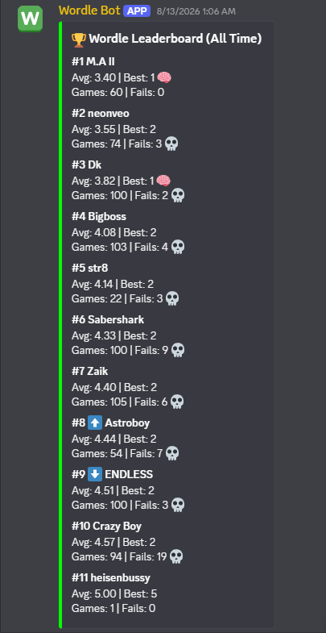
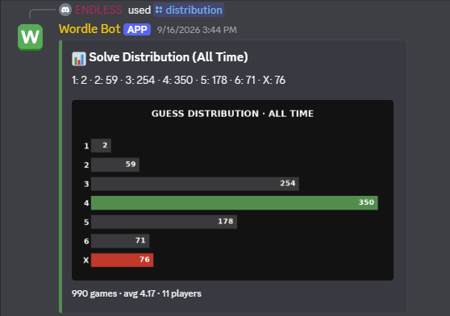
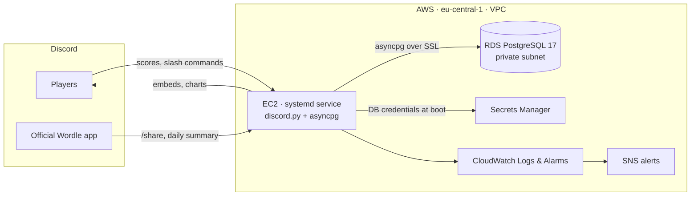

<div align="center">

# 🟩 Wordle Leaderboard Bot

**A season-based competitive ranking system for Wordle, running 24/7 on AWS.**

[](https://www.python.org/)
[](https://discordpy.readthedocs.io/)
[](https://www.postgresql.org/)
[](https://aws.amazon.com/)
[](LICENSE)

</div>

---

My Discord server has played Wordle together every day for years. This bot turned that
habit into a league: it reads scores straight out of chat, ranks everyone by average
attempts, tracks streaks and daily wins, and hands out quarterly and yearly awards —
all without anyone typing a score twice.

Scores arrive three ways: the official Wordle app's `/share`, its daily results
summary, or a plain `Wordle 1418 3/6` message. The bot parses all three, resolves
mentions and display names to real Discord users, and stores everything in PostgreSQL
on AWS RDS.

<!-- Screenshot: drop docs/leaderboard.png in place, then delete these two comment markers. -->
<!--
<p align="center">
  
</p>
-->

## Highlights

- **Seasons that reset without deleting anything.** Every board is a query window, so a
  new quarter starts standings fresh while the full history stays queryable.
- **Drift-proof puzzle numbering.** A summary posted after midnight used to push the
  Wordle number forward a day at a time; it once drifted five days. Now the number is
  anchored on the play date and capped so it can never run ahead of reality.
- **Idempotent ingestion.** Replays, edits and duplicate summaries converge on the same
  rows — every write is an upsert keyed on `(user_id, wordle_number)`.
- **Ranked by more than average.** Crowns for daily wins, uncontended crowns for solo
  wins, streaks, fails, rank-change arrows, and a weighted composite champion score.
- **Corrections without data loss.** Bad days are *voided* — globally or per user —
  rather than deleted, and every board honours those voids in one shared SQL fragment.
- **Built to run unattended.** systemd service with a single-instance guard, credentials
  from Secrets Manager via an instance role, logs and alarms in CloudWatch.

## Commands

| Command | What it shows |
|---|---|
| `/leaderboard` | Ranking by average attempts, with ▲▼ arrows against the last puzzle |
| `/stats` | Your average, best score, games played, fails and last game |
| `/streak` · `/streaks` | Your current streak · the top 15 |
| `/crowns` | Daily first-place finishes per player |
| `/uncontended` | First places won outright, with nobody tied |
| `/fails_leaderboard` | Who has missed the most (`X/6`) |
| `/distribution` | Solve distribution chart, server-wide or for one player |
| `/monthly_champions` | The 1st-place finisher of every past month |
| `/quarterly_champions` · `/yearly_champions` | Award winners per quarter and per year |
| `/voided_wordles` · `/voided_user_wordles` | Which days don't count, and for whom |
| `/help` · `/banned_users` | Command reference · current exclusions |

Most boards accept `era`, `season`, `year`, `month`, `quarter` and `min_games` to slice
any window of history.

<details>
<summary><b>Admin commands</b> (14 — data management, admin-gated)</summary>

| Command | Purpose |
|---|---|
| `/add_scores` · `/remove_scores` | Set or delete one player's result for a puzzle |
| `/add_fails` · `/remove_fails` | Adjust `X/6` records directly |
| `/add_crowns` · `/remove_crowns` | Award or revoke a daily win |
| `/void_wordle` · `/unvoid_wordle` | Void a puzzle for everyone |
| `/void_user_wordle` · `/unvoid_user_wordle` | Void one player's result |
| `/ban_user` · `/unban_user` | Exclude a user from every board |
| `/import` | Backfill scores from a channel's message history |
| `/reset_leaderboard` | Hard wipe — rarely needed, since seasons reset by window |

</details>

## Core concepts

### Boards are query windows, not tables

Nothing is ever deleted to "reset" a leaderboard. Every board composes its `WHERE`
clause from shared filters in [`utils/range_filters.py`](utils/range_filters.py):

- **Era** — `build_era_filter()`. Puzzles at or above the era cutover are current;
  earlier ones are reachable with `era=legacy`, and `era=combined` counts both.
- **Season** — `build_window_filter()`. The default board shows the quarter in
  progress, so standings start fresh every three months. `season=all` restores the
  full era.
- **Precedence** — explicit `quarter`, then `year`/`month`, then the season default.
  That order is load-bearing: the monthly recap passes a year and month and must get a
  whole month, not a month intersected with the current quarter.

The consequence is that a "reset" costs one predicate and loses no history.

### Puzzle numbers that can't drift

The Wordle app posts yesterday's results shortly after midnight — in whichever timezone
a player happens to be. An earlier version derived the day's number from
`MAX(wordle_number)`, so a single off-by-one fed the next day's calculation and the
error could only grow. It reached **+5 days** before being resynced.

The current numbering ([`utils/parsing.py`](utils/parsing.py)) is anchored three ways:

1. The number comes from the **play date**, never from the last stored number.
2. When a day already has a summary, the app's own *group streak* decides whether this
   is genuinely the next puzzle or a duplicate of the same day.
3. A hard ceiling: a summary can never describe a puzzle that hasn't happened yet.

### Three ingestion paths, one idempotent pipeline

[`cogs/events.py`](cogs/events.py) routes every message by priority — daily summary,
Wordle app `/share` embed, then admin-typed text. Each path converges on the same
writes:

- Summaries are gated on the official app's user ID, so nobody can fake one, and logged
  by `message_id` in `summary_log` so reprocessing is a no-op.
- Scores upsert on `(user_id, wordle_number)`; crowns and bans use
  `ON CONFLICT DO NOTHING`.
- Summary lines are messy — multiple players per line, display names with spaces, a mix
  of mentions and plain text. [`utils/user_resolver.py`](utils/user_resolver.py)
  resolves them to real members and reports anything it can't match instead of guessing.

### Awards worth arguing about

Each quarter and year, [`utils/awards.py`](utils/awards.py) computes the best average,
most crowns, most uncontended crowns, best single solve, hardest puzzle of the period —
and an overall **champion**. The champion isn't just the best average: five components
are min-max normalised to 0–100 across the qualifying field, then weighted (average
40%, crowns 25%, uncontended 15%, best solve 10%, games played 10%). Attendance floors
keep a player who showed up twice from winning on a fluke.

The ▲▼ arrows on `/leaderboard` come from `leaderboard_snapshots`, a per-puzzle
rank snapshot written as each day is processed.

<!-- Screenshots: drop docs/awards.png and docs/distribution.png in place, then delete these two comment markers. -->
<!--
<p align="center">
  
  
</p>
-->

## Architecture


```mermaid
flowchart LR
  subgraph Discord
    U[Players]
    W[Official Wordle app]
  end

  subgraph AWS["AWS · eu-central-1 · VPC"]
    EC2["EC2 · systemd service<br/>discord.py + asyncpg"]
    RDS[("RDS PostgreSQL 17<br/>private subnet")]
    SM[Secrets Manager]
    CW[CloudWatch Logs & Alarms]
    SNS[SNS alerts]
  end

  U -->|scores, slash commands| EC2
  W -->|/share, daily summary| EC2
  EC2 -->|asyncpg over SSL| RDS
  EC2 -->|DB credentials at boot| SM
  EC2 --> CW --> SNS
  EC2 -->|embeds, charts| U
```

```
bot.py                  entry point — pool, cog discovery, command sync
config.py               all env-based configuration
cogs/                   one Cog per feature domain (11 of them)
  events.py             on_message routing to the parsers
  leaderboard.py        /leaderboard, /stats
  admin.py              data management commands
  ...
utils/
  parsing.py            score + summary parsing, streak calculation
  range_filters.py      shared era / date / season SQL windows
  awards.py             quarterly and yearly award computation
  leaderboard.py        ranking queries and embed rendering
  user_resolver.py      names and mentions to Discord users
  admin_helpers.py      void SQL, puzzle-number arithmetic
db/pool.py              asyncpg pool over SSL
aws/secrets.py          RDS credentials from Secrets Manager
```

## Data model

Eleven tables in PostgreSQL 17. Every one is keyed so that re-processing a message is
harmless:

| Table | Key | Notes |
|---|---|---|
| `scores` | `(user_id, wordle_number)` | `attempts` is `NULL` for an `X/6` fail |
| `fails` | `(user_id, wordle_number)` | Dedicated fail tracking |
| `crowns` | `(user_id, wordle_number)` | One row per daily first place |
| `uncontended_crowns` | `(user_id, wordle_number)` | One row per *solo* first place |
| `voided_wordles` | `wordle_number` | Puzzle voided for everyone |
| `voided_user_wordles` | `(user_id, wordle_number)` | Puzzle voided for one player |
| `banned_users` | `user_id` | Excluded from every board |
| `monthly_winners` | `(year, month)` | Recorded 1st place per calendar month |
| `period_awards` | `(period_type, year, period, category)` | Quarterly and yearly awards |
| `leaderboard_snapshots` | `(wordle_number, user_id)` | Powers the ▲▼ rank arrows |
| `summary_log` | `message_id` | Makes summary processing idempotent |

Every board query excludes banned users and honours both void tables through a single
shared `NOT_VOIDED_SQL` fragment, so a new board can't accidentally forget either rule.

## Infrastructure

| Concern | Service | Why |
|---|---|---|
| Compute | EC2 `t3.micro`, Amazon Linux | Long-lived gateway connection, cheap to run 24/7 |
| Database | RDS PostgreSQL 17 | Managed backups, private subnet, SSL-only |
| Secrets | Secrets Manager | No credentials in code, on disk or in env files |
| Identity | IAM role + instance profile | Instance fetches its own secrets; no static keys |
| Network | VPC + security groups | RDS reachable only from the bot's security group |
| Observability | CloudWatch + SNS | Log shipping, 7 alarms including a liveness check, email alerts |

<details>
<summary><b>How each piece is wired</b></summary>

**EC2 / systemd** — the bot runs as `wordle-bot.service`, restarting automatically on
failure. A PID check at startup ([`bot.py`](bot.py)) refuses to boot a second instance,
which matters because two gateway connections would double-process every message.
stdout is appended to `/var/log/wordle-bot/bot.log` and shipped to CloudWatch Logs.

**RDS** — PostgreSQL 17 in a private subnet with no public endpoint. The bot connects
with `ssl="require"` through an `asyncpg` pool of 1–5 connections
([`db/pool.py`](db/pool.py)), created once in `setup_hook` and shared by every cog.

**Secrets Manager** — the database username and password are fetched at boot with
`boto3` using the EC2 instance role ([`aws/secrets.py`](aws/secrets.py)). Nothing
sensitive lives in `.env` beyond the Discord token and the secret's ARN, and rotating
the password needs no redeploy.

**IAM** — the instance role carries only what the bot uses: read access to its one
secret, and CloudWatch log/metric writes.

**VPC** — the RDS security group accepts `5432` from the bot's security group alone,
so the database is unreachable from the internet even with valid credentials.

**CloudWatch + SNS** — logs stream to `/wordle-bot/application`. Seven alarms publish
to an SNS topic that emails the admin: EC2 CPU, EC2 status checks (wired to instance
auto-recovery), RDS CPU, RDS connection count, RDS free storage — and a liveness alarm
built on the bot's own 5-minute heartbeat log line, so a silently hung process pages
someone instead of going unnoticed.

</details>

## Running it

```bash
pip install -r requirements.txt
```

Create a `.env` with:

```ini
DISCORD_BOT_TOKEN=...      # bot token
RDS_SECRET_ARN=...         # Secrets Manager ARN holding the DB credentials
RDS_HOST=...               # RDS endpoint
# optional: AWS_REGION, RDS_DBNAME, RDS_PORT, WORDLE_TZ,
#           CURRENT_ERA_START_WORDLE, MONTHLY_MIN_GAMES, TESTING_MODE
```

Every tunable — era cutover, season start, attendance floors, champion weights — is an
environment variable in [`config.py`](config.py), so there are no magic numbers buried
in queries.

```bash
python bot.py
```

On the production host:

```bash
sudo systemctl restart wordle-bot.service
sudo tail -f /var/log/wordle-bot/bot.log
```

## Tests

Dependency-free assertion scripts — no framework, no fixtures, no database:

```bash
python test_seasons.py           # season cutover, quarter rollover, filter precedence
python test_awards_fields.py     # one award table drives both award surfaces
python test_distribution.py      # chart binning, empty buckets, all-fails
python test_help_fields.py       # /help stays under Discord's 1024-char field cap
python utils/user_resolver.py    # name and mention resolution self-check
```

The precedence tests exist because that ordering is the easiest thing to break: get it
wrong and the monthly recap silently reports a partial month.

## License

[MIT](LICENSE). Wordle is a trademark of The New York Times; this is an unaffiliated
hobby project. Built with [discord.py](https://github.com/Rapptz/discord.py) and
[asyncpg](https://github.com/MagicStack/asyncpg).
