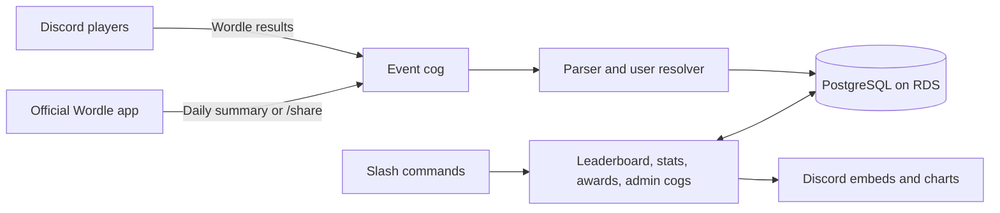

<div align="center">

# 🟩 Wordle Leaderboard Bot

**Turn a Discord server's daily Wordle habit into a fair, durable competition.**

[](https://www.python.org/)
[](https://discordpy.readthedocs.io/)
[](https://www.postgresql.org/)
[](https://aws.amazon.com/)
[](LICENSE)

</div>

Wordle Leaderboard Bot reads results from Discord, preserves them in PostgreSQL, and makes a server's daily puzzle into a season-based league. Players share a result; the bot handles ranking, streaks, crowns, history, and awards.

## Why it stands out

- **One pipeline, three input formats.** Ingests official Wordle `/share` posts, daily summary messages, and admin-entered results. Mentions and display names are resolved to Discord users instead of treated as loose text.
- **Safe to replay.** Scores are upserted on `(user_id, wordle_number)` and summaries are logged by message ID, so edits, retries, and duplicate deliveries converge instead of inflating the leaderboard.
- **Seasons without data loss.** Leaderboards are SQL query windows, not disposable tables. A new quarter starts fresh standings while legacy, current-era, combined, monthly, and all-time views remain available.
- **Corrections are auditable.** A day or individual result can be voided rather than deleted. Every board shares the same exclusion rule for banned users and voided results.
- **More than an average.** The bot tracks first-place crowns, solo crowns, fails, streaks, rank movement, solve distributions, monthly winners, and quarterly/yearly awards.

## How it works


```mermaid
flowchart LR
    A[Discord players] -->|Wordle results| B[Event cog]
    C[Official Wordle app] -->|Daily summary or /share| B
    B --> D[Parser and user resolver]
    D --> E[(PostgreSQL on RDS)]
    F[Slash commands] --> G[Leaderboard, stats, awards, admin cogs]
    G <--> E
    G --> H[Discord embeds and charts]
```

The application uses `discord.py` cogs to keep event handling, presentation, awards, and admin operations separated. `asyncpg` provides a shared SSL connection pool, while RDS credentials are fetched from AWS Secrets Manager at startup.

## Commands

| Command | Purpose |
| --- | --- |
| `/leaderboard` | Rank players by average solve score, with optional era, season, date, and minimum-game filters |
| `/stats` | Show a player's average, best solve, fails, games played, and live streak |
| `/streak` · `/streaks` | View a personal streak or the server's top streaks |
| `/crowns` · `/uncontended` | Track tied first-place finishes and solo wins |
| `/fails_leaderboard` | Show `X/6` results by player |
| `/distribution` | Render a server-wide or player-specific solve distribution chart |
| `/monthly_champions` | Browse monthly first-place winners |
| `/quarterly_champions` · `/yearly_champions` | Browse period awards, including the weighted champion score |
| `/help` | Show the in-Discord command reference |

<details>
<summary><strong>Admin tools</strong></summary>

Admins can import history, add or remove scores, fails, and crowns, ban or unban players, and void or restore a Wordle globally or for one player. These operations preserve consistency between scores, fails, crowns, and uncontended crowns.

</details>

## Core design choices

| Concern | Approach |
| --- | --- |
| Ranking | Failed solves use a configurable penalty; optional views can exclude them from average calculations. |
| Time windows | Explicit quarter, year, or month filters take priority over the current season window. |
| Puzzle identity | Wordle numbers are derived from the play date and capped at the current puzzle, preventing cumulative numbering drift. |
| Award fairness | Minimum attendance thresholds prevent a small number of strong games from winning period awards. |
| Operations | A five-minute heartbeat, single-instance guard, and structured startup checks support unattended hosting. |

## Project layout

```text
bot.py                 application entry point and cog discovery
config.py              environment-driven runtime settings
cogs/                  Discord commands and event listeners
utils/parsing.py       result ingestion, summary handling, streaks
utils/range_filters.py shared era, date, and season filters
utils/awards.py        quarterly and yearly award calculations
db/pool.py             asyncpg pool with SSL
aws/secrets.py         RDS credential retrieval
```

## Run locally

Requires Python 3.12 and a PostgreSQL database reachable with the configured RDS credentials.

```bash
pip install -r requirements.txt
```

Create a `.env` file:

```ini
DISCORD_BOT_TOKEN=...
RDS_SECRET_ARN=...
RDS_HOST=...
```

Optional settings, including the Wordle timezone, era cutover, season start, award thresholds, and test-guild mode, live in [`config.py`](config.py).

```bash
python bot.py
```

## Checks

The repository uses lightweight assertion scripts for the error-prone behaviour:

```bash
python test_seasons.py
python test_awards_fields.py
python test_distribution.py
python test_help_fields.py
python utils/user_resolver.py
```

## License

[MIT](LICENSE). Wordle is a trademark of The New York Times; this is an unaffiliated hobby project.
